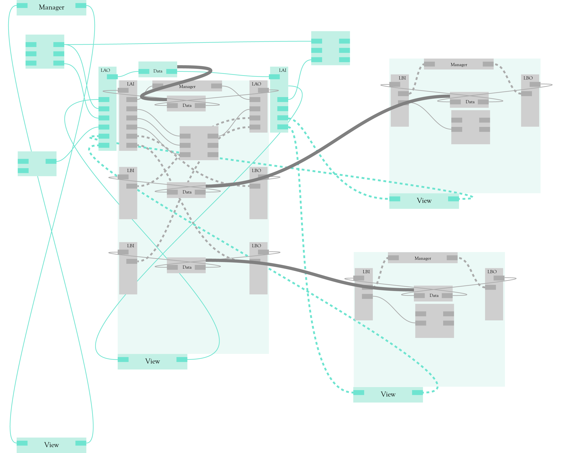

# Cuttlefish Dev Log / Scratch Notes

## Dev Prayers for Machine Week

things that *should work* before MW
- properly handle logging of *anything* and be able to inspect any datatype with this kind of tool (i.e. see the path...)
- err path cleanup ... i.e. cover cases of new hunk writing:
 - syntax errors (in code, on load)
 - file naming errors
- dom access (this is bigish, and maybe containable)

### CF pre MW

- save / open program with UI information... positions
- hunk loading error paths / errors from hunks appear by hunks / same with logs
- the merge / recreate / state searching algorithms are key, and no good, and maybe require / want a UI rewrite. i.e. I am running bootstraps now at the stepper (and the DLPcores later) that write new link states, etc, and those push 'replaceDef' msgs up to cuttlefish *on hello* ...
- i.e. also: try restarting / refreshing lower levels: we broke: fix or remove functionality

#### Dev:
- jquery, d3 are in the view/ folder
- dom rework (multiple doms... the global $().find() problem)
  - dom: request animation frame (i.e. in ghost) is not deleted,
- hunkify ?


### Compound Dmseg and MDMseg

I would *really* want to see MDmseg, and Dmseg, as made up of compound types: a great example for in-context abstractions, readily taken apart, and of using known serializations to deliver complex types downstream. This I would like to take shots at today, or / a looping example.


### JS Afternoon

data from other sources / udp / streams etc
the complex / compound data type wrap is order 1
motion control pls
MDArray(number) type, similar for others?
Compound typing
Array(type) (functional typing... this 'of' this, not this 'and' that)
Useability / bughunting ...
Accel control -> pressure inputs, jogging?
ReadCSV / ReadJSON / Load on Default? / WriteJSON / Cleanup...
Other 'basics' - addition, subtraction, and for various types?
Expression... / evaluate
UI?

paths are MDArrays
unwrap MDArray
3d vector display ++
chart
task: take path from JSON, split mdarray -> components, chart x, 3d render xyz, ok

## Dev Golf

hour +/- long tasks under existing structures,

```
- assign meaning to charts and graphs (date / location / etc)  
 - this should be generic json-object making, yeah? / csv
- save tests as .json objects (optionally) develop program for reading  
 - overlay multiples, save images  
 - read-in csv as well, polymorphic for outputs
- generic wrap / unwrap data objects ...
- the force loop / layout (floop.js)
 - wire length != zero
 - better keepout-rectangles
 - spawn new hunks at the mouse (floaters! things 'inside' of others!)
 - how to do this all elegantly ... it's ah big redesign: take some hours, consider, maybe it's not so grand ?
- sys / save etc
 - dates & times in metadata on list ...
 - save systems w/ layout ??
- menu
 - arrow keys to bump through items
- import
 - lit-html, emojis don't load when developing offline: store them somewhere.
 - lit-html just writes html strings into the dom? probably easy to rm
```

## Examples

Build a looping structure that replaces / stands in for traditional 'for/while' type structures. Recursing through offsets for the path is the currently pertinent example. Again this is a kind of polymorphic issue / etc. Want to write one kind of recursor, often need some secondary trigger / flowcontrol gate item that is of-the-appropriate-type.

## Aspirational Dev

Things we want to see, extensions, etc,

### Compound Types

I was thinking about the cf 'api' / workings today. At the moment there is this convoluted / poorly named system where `the view messages the manager` with some similarely-but-not-well-named names. In the browser, these are actually hooked up through a messaging loop, to abstract in the same way in JS / CPP (remote) and / JS (remote). This was great for development, but there's another way to do it that might be much nicer for the future... which iiiis to retain the 'view' object, but (at the top level) attach each of it's core function (the eight) directly to the manager's reciprocal function, both cast as promises. Other views can call the same promises, but in those cases they're hooked to the view's messaging 'subsystem' ... put this note in the relevant repo.

For mixed up data types / polymorphism / I just had this idea this morning (more of a clarification) about compound types, and their wraps. Compounds, and Compound Arrays. This is maybe worth some time, and some drawing. I was considering the Squid/Protocol in the context of big serverside apis / the microservices trend. This future where people don't build eachother's software source, but people plug into eachother's operating hardware: where we collaboratively wire together one big operative graph. To mux big data objects, we can wire up / bundle compound data types, named. This is a serialization that rests on our core set of byte-structures, and a wrapping / unwrapping tool, that names things. For instance: a compound wrapper is a hunk having some set of inputs, and one output. The inputs are typed / named as is tradition. Some of these can even be other compound data types. The wrapper (sync / async) takes data off of its inputs, and wraps them into one serialized message, that has some known 'compound' structure... Like, a list of names, then data bits all serialized in key, with type-keys leading. In the compound array messages, we have an array of these compound types (this is the CSV type), where we have one list of names, arrays of these type-keyed objects.

This is a really nice thing that I would really want to see. Compounds should maybe have names, but should maybe just be id'd by their final roots: any ordered set of the-same types of data should be compatible with the same: that's really the data-type identifier... Noice.

... treating data like this allows complex, application / architecture specific representations to be used, but bundles interoperability into the core datatypes we ... likely all agree on. this is on the expectation that computing becomes more specialized as we progress, not less.

### Better Error Paths

I do, really, want to use this as a wrench. The first component to that is to reconsider error- and logging paths. Though this might add some small delay, I can wrap the cuttlefish manager's loop in a try/catch loop (over per-hunk loops as well). I can write logs out to a floater that is associated with that def's core. Top level logs can come from the manager... bootstrap can catch very top level, those would be halting. Error paths should also default to logging to the console as well... and modifying both to change logging behaviour should be possible.

# Past Logging (Completed or Forgotten Tasks)

## Next Desires (2019-09)

I think that mostly I would like to focus on the potential of a KOA / Express cuttlefish & vfp package, to run local systems away from my active development.

Following this, probably the best things to do will be address things like type inconsistencies, and add better error pathing... Also, tickets like the network-level view, and starting to daydream about the interstitial routing layer, if it exists? That awkward link.

## The Latest (2019-07)

I'm excited about this, so here's two images:


... many lines of js later, I can 'explode' hunk definitions, which means I can invert link relationships, so that I can visually explain nested network relationships in the graph. I've also simplified a lot of view objects, and have come up with this satisfying idea about recipes and atomic operations that I enjoy - that helps me a lot in patch loading, saving, etc - especially for big messy patches (I hope). I have also learned: UIs are a PITA.

Here's the 'unwrapped' link on an 'edgecase' link. This is like looking through a door: depending on the side you're on, the hinge is on the left... or the right... or, fittingly, tx and rx are rx and tx depending on from-where you take your UART names. The cable flips. Etc.

To wrap these things, I can compose 'recipes' from cuttlefish, to manipulate graphs, i.e. building routes and then organizing visual heirarchy accordingly:


Alright, here's the real moment: opening two-layers-of-links down into a (home for) an embedded instance.


Couple of things, at this point:
 - browser performance ... starting to feel the lag, surely, many things could be done to improve this. another day.
 - video capture makes thigs ~ 4x slower. graphics? idk

OK, after some more testing with genuinely time sensitive systems, I'm not interested in doing planning in the browser anymore. That means that I want better tools to work intimately between node and the browser. To start, I refined my route building tool, so that I can quickly push events down layers. Here's a clip of my ui element (an arrow pad) connecting to a planning element that needs to run ~ 100Hz loops to hardware:


## w/r/t force layout

I've re-written much of the display code. the 'view' hunk, that does rendering work, is about 2500 lines all together at this point, which is a pretty yikes-level of code for me.

That said, it's basically the whole project's workhorse - which is interesting in itself. This is one thing I'm definitely excited about for the project: the contexts / managers are *very* simple - the whole thing has this pretty straightforward 'hind brain' that is just pushing memory around (inside of contexts) and pushing bytes around (over the network).

This might sound like a boast, but I guess this is kind of similar to writing a programming language ... at the base, the instruction set is really small. The syntax, rules, compiling, etc of the language is big, cumbersome, and messy.

The most recent add is to do with making visual sense of nested programs. In order to do this, I've broken up what were previously single ```<div>``` elements into collections of them... i.e. inputs, outputs, and state each get a box to live within. This causes some more complexity to the view program because I have to keep track of these handfuls of html elements, and then there's this: I use the same mechanism to 'explode' hunk-definitions, and to 'wrap' (i.e. links) around others (i.e. views). This is really handy, because it lets me accurately draw link->link representations 'across' the link divide, and lets me 'unwrap' a pattern that was very visually cluttered: this common 'hourglass' structure (i.e. feedback).

So, I wrote this all in a rush, in what felt like a javascript bender, and now I'm trying to catalogue accurately what-all happened, to track and hopefully resolve. What I'm working towards is bringing force layout back into the picture, because (as is easy to tell when opening a big program) these things are *hot hot* messes, and I'm not up to storing positions exactly yet, because that sounds counter to the point.

Here's the things I'd like to be able to do:
 - blow-up definitions, having inputs, outputs, and cores be in potentially different places.
 - have 'exploded' elements, probably most often used to 'unwrap,' say, a data pipe around a link, (to unconfuse the hourglass)
 - using exploded elements, pin outputs to the left, and inputs to the right. this in particular to show a link 'across' a view
 - wrap a link around a view
 - resize views, and other 'native' elements.

Other tricks
 - the message board should perhaps belong only to the top-level view, and should be easily hidden

### Considering Force Layout

There'll be a handful of tricks to make this work out well

 -> a good update model
  -> this thing can also check our 'rulesets' per the heirarchy, for links and views and whatnot
  -> that's a kick (topology changes and checks), and a tick (simulation step)
  -> integrating this with manual movements ...
 -> the floop should probably *only* run at the top level ... but subroutines will be nice per view because
 -> we will have / want to adjust the size of sub-views (in a bubbling kind of way) from the bottom-up... i.e. we really want to avoid overlap, etc

Probably a good first step is a run through the .def tool, to invent a decent API for moving, exploding, gathering, etc. making 'edge' types. Three types...
 - fixed
 - exploded (just str8 up kapow, but maybe as a rule just blow up the input ?))
 - wrapped
 - unwrapped

For each object, I'll want to re-write the .deg api so that .deg.inputs.moveto() is a viable function, etc ... such that when I'm running through the sim, every free entity can be one of these ->

floater.moveto(x,y) // floater.fix(x,y)

and those can be walked as nodes ...

dragging objects ? just kill the sim I guess ? or fix it during the sim ...
dragging objects should use the same floater.moveto() setup, or a .moveby()

then I also have to handle native-element resizing ... so .wrap objects need to react to that...

and then there's this question about how to do it heirarchichally - or all at once, in one floop ? maybe all at once is easier ...

A good way to set rules ... like, what's fixed etc. I.E. consider -> the ears of a link expand 'around' a program, pushing the view definition 'out' - how will these 'forces' be connected? Just .set the view to match, let them float? Pin the left to 0,0 and float the right? Then take the lower level constraints as fact? nice.

## Traversing Heirarchy

I am having a feeling that I am going about this poorly. I should remember that I am here to build a tool, not get into semantics about UI and write nice APIs for myself. Alas, black holes abound.

I need to get to ponyo.

I want to open programs with heirarchy. I'm close to doing this but I have to suss out this relationship between the top-layer view and the lower-level(s) view(s).

I think my issue is that I'm just kind of trammeling through this without any strong ideas about how the larger structures will work. Lower level things feel OK so far.

On a lack of heirarchy sweeping... I am curious to keep the recepies to a minimum. Surely, I'll save systems with heirarchy. When I'm loading them, I can be intelligent about how to make the dives. Once I load a layer, any links (with programs defined beneath them) I can interrogate. I can write a routine to hunt (using link-traversal) for connected views. If those views are available, I'll connect those views to the link (definition?) and use those to traverse another layer. Then I can do program->link.view->defs... as a reference structure. This means that, yes, I should attach (to link defs) view (hunks). Which *may* get somewhat confusing. However!

This handles program traversal. What else I need is to wrap on (hah) my implementation of these force layout loops. Critically, I need events to 'bubbble' through them.

My missing link, and maybe the only thing I haven't really api'd well, is the resize-ability of elements. As a hack, I wrote this into my domtools tool ... which leaves things somewhat ambiguious. I need to call a resize: (1) on ui events, and (2) internally - i.e. a view(hunk) or any other native(hunk) should be able to call .requestResize(w,h). Any time the resulting element.resize(w,h) fn is called, a change should be triggered: this layer's floop should run from alpha(1) (making sure it has a bigger r, now). This floop, I think, will (in a few cases) also call it's domain's .requestResize(w,h) event - so, that's the link through.

In the same vein, a lower level view has a key difference from the higher level view, in that an element (floater) moving around inside, should not be able to move past the 'wall' of the view's plane. I can probably do this in a few ways, (1) by just writing in limits... but I will have to differentiate between lower-level views and higher-level views. I can also modify lower- and upper- level floops to incorporate (or not) a force at the edges. This would be for an investigation into the floop's internals (i.e. the D3 force library).

## Nested Floops and Resize Transoms

Floaters, each view runs a floop, using resize events to pass between heirarchies.

A good exercise at this point would be to describe how / what level you'd like to organize API stuff. Whomst has which links, functions, references. Particularely, use the cases of resizing. Try to go fast.

The floop should be able to .reset() during topology changes, and .restart() for others - drags, etc. Perhaps a third, or perhaps during .restart, to recalculate sizes (but not adding or rm'ing nodes or links) - especially useful for a resize event.

The resize, also, (at the moment, terribly buried in the domtools) often wants to call multiple other events - one for the floater that contains it, one for the native hunk it represents (if it's a native block). The floater that contains it (confusing, also, bc the floater might be a link / wrap) should call it's view's .restart() fn.

## The Simulation Implementation

The simulation definitely does things, but at the moment there are two big flaws. Hopefully I can just get rid of these instead of writing about them. Primarily: (1) circles are not actually a good collision metric and (2) 'links' at the moment are drawn as if they originate from the center of each representation.

This is (maybe) worth documenting. A meta-note is that, doing this again, I would probably draw all of my svgs with D3 as well. Here's a few links:

[force layout in d3](https://www.d3indepth.com/force-layout/)
[cola - different solver](https://ialab.it.monash.edu/webcola/)
[rectangular collision](http://bl.ocks.org/natebates/273b99ddf86e2e2e58ff)
[more rectangles](http://bl.ocks.org/ilyabo/2585241)

A few of these examples are from D3 v3, while the newest version is D3 v4 - particularely, this update changed how force layout works. So.

[some more help](https://hi.stamen.com/forcing-functions-inside-d3-v4-forces-and-layout-transitions-f3e89ee02d120)

D3 is continually being-very-cool. Here's another neat trick: a [quadtree implementation](https://github.com/d3/d3-quadtree) that makes collision-detections not computationally cumbersome.

Great, so I took a look also at the source (der), [here](https://github.com/d3/d3-force/tree/master/src), in particular, the [collision module](https://github.com/d3/d3-force/blob/master/src/collide.js) is (obvious reasons) what I want to modify. I swapped the .forceCollision() d3 function in for a module, and got to writing...

First note I came here to write down is that I can eliminate the prepare() function that is walked before the 'visit' (ok, quadtree words). This is because I am keeping my own radius (or equivalent) data right on the nodes. Integrated systems get +10 pts.

So, cool, and I did the same thing for the link force - this time modifying the x-terms it uses to offset left/write of the floaters' bounding box. Last rites here is writing in individual link y-offsets (at write-time) to use in lining up in the y-direction.

## Boundary Conditions

The top-level space doesn't exactly have anything to prevent floaters. It would be great to do some graph organization routines that 'pin' parts of these things down.

## Speeding Up, and UI Events

 - don't need to redraw *every* link *every* time. Link redraws should be triggered per object, like (floater).links.forEach((link) => {link.redraw()})
 - floaters use messy organization to check- and recheck- state when asked to move, these things could be improved
 - floater children could be smarter. i.e. consider the view's hunk being an item in an otherwise-link floater's bag ... *this* mismatch is what makes the resize callbacks troublesome.

## Jake's Notes on Writing UIs

I've taken a handful of passes through righting this monster. Like any other project, at the nth pass I finally feel as though I am properly equipped to design what I've made. Prior to this project I had never designed a UI, but in some senses the crux of the whole project is about UI - more broadly, about representation, and putting handles on complex problems. In a few steps, this was about coherence in computing model, and then in messages, and then, in the UI, in state tracking and drawing.

OK, so what have I learned?

UIs are kind of like state machines... one big tripping point was in deciding where to keep 'truth' about what state was what. The DOM is obviously a strong model for this, but it can be cumbersome to access (i.e. I'm thinking of .value keys on input objects, etc) - this is the reason we see JS littered with 'getters' and 'setters' - a getter can parse out of whatever bedrock storage, and a setter can be written to modify requisite dom elements, even if those dom elemengts change.

Abstraction is nice, but requires real foresight, and can be a black hole. This is also a statement about truthyness / bedrocks... elegance can be tough.

UIs should have a runtime model: or ideas about events. Lots is going on - often we are processing mouse clicks, drags, values, buttons, etc. We don't know what is going to happen in what order. In this case, there is this kind of 'global' problem of running the force-layout simulation. This thing needs to be poked at the right times, stopped at the right times, etc. s

Access-to-parents-and-children. This is kind of true all the time, but is especially true w/r/t the runtime / events mentioned above. It's really nice to be able to bump up and down heirarchy to call parent's events, etc. Children should be given handles to their parents, parents should have good handles on their children. In some cases, (i.e. defs, floaters, and floater-elements), two graphs share common elements, at varying levels in their structures.

For a case study, my current implementation (as of June 8 2019) of resizing native-hunk-dom-elements, is a hot mess. Resizing code is local to the element itself, and fires a few callbacks that aren't really tracked anywhere... Just poke through that on the next pass, to get a sense for what I mean.

## On Usefulness / Heavy-Handedness

One choice that I made early on was to try to leave the 'view' repreesented as 'a hunk' running in cuttlefish. I still like this, and it gives me a good way to express 'manager messages' traversing down heirarchy. It also lets me use 'recipes' to compose UIs from links / etc. It's eating my own dogfood.

However, it clutters the view with ... well ... hunk representations of views and managers. There's some temptation to get rid of these things. Primarily because they don't actually add any value to us when we're using this thing to compose programs.

Another take is to give hunks direct access to their managers, and do some invisible routing. I.E. rather than composing a route 'down' to a link, across a few links, pass a message to link->manager->link->manager->link .. via indexed messages. I.E. a manager receives from the link 'message for hunk_ind | msg' and messages are passed along this way.

With infinite time, this might be a compelling re-write. It would also allow me to localize hunk-descriptions, and state change calls. I.E. links could pass messages to managers 'message for hunk_ind | stchreq:ind:value' and hunks can have a handle to rx / handle these as well. Super-locality would be nice, would potentially make managers really simple. And responses could probably be source-routed back out.

So, that's tempting. However, I think this can go forwards to flesh out hunks etc, and I can be set up to make such a re-write actually pretty easy if enough evidence presents itself for it. Always learning.

## Before Wrapping to Ponyo

Making this into a useful tool is going to be a slog. Has been a slog. The best way to develop it is to do more and more messy and difficult stuff with it. To wrap and move on, I need to:

(1) complete force layout using rectangular collisions and appropriately-placed links.
(2) save ponyoDevTool.json - a nesting patch - and load it. this involves finalizing link.js / link.cpp 'api' - i.e. open/closed state, tossing messages when closed (?or?), and the reciprocal-index state value.

From there, I think the most important work to do is developing the hunks themselves. I should try to imagine a useful set, draw the programs I think I will want to use for mocontrol (and the instron is a good case), and get to work. Getting work out to other users and programmers, also big.

### Done that. Ok.

## Last Notes 2019/06/16

Ok, since I'm moving away from trying to write this UI, and towards trying to get it to assemble systems that do stuff, I'd like to take the minute to write down how I feel about it as is, and where I think I would go with it next.

To start, I will wait for the end of the thesis to even think about trying to overhaul this thing. That said, I would feel really good about an overhaul, given all I know now.

My first hauling move would be structural. As it stands, I find myself often wanting to reach around / through / within particular UI objects, and I haven't been explicit enough about (didn't think I was) building an object model. The 'manager-type' model should be primal: lists of definitions (of hunks). Beyond that, lots happens. Definitions (def) have elements (state items, inputs, outputs, and sometimes a 'native' element). These are organized then into what I call 'floaters' - these are the discrete units that the force simulation operates on. Floaters contain groups ('bags') of browser .dom objects. Each of these objects is position:absolute'd and is written to place via the force loop -> floater -> element offsets. This all works, somewhat to its own detriment.

Before opening that model's can of worms back up, I might do a think about network representation, especially considering the cases that don't explicitly work in the current, nested, heirarchichal organization. I.E. these case I really love to daydream about where most interaction is physics -> physics, or physical IO -> machine, and the loops close elsewhere in the machine. At the moment, there's not a way to display a link out-of-line of the root-in-browser heirarchy, so to speak. That said: the model supports it. I can open a link between two contexts that doesn't traverse through the browser, or through a higher level element, no problem. I just can't draw it. So, this is a driving desire for a new 'floater' model. In addition, I want a wrap on the elements that the floater carries. These are the things (clumps?) that both floaters and defs manipulate, they should be basic element types. Buttons, inputs, outputs, states, etc.

The next topic, and biggest item available for a purely performance-interested overhaul, is the link drawing method. At the moment, it's an atrocious complete-wipe and redraw routine. Not necessary! I can imaigne an elegant solution where, i.e. these clumps (mentioned above) are root-and-tail for links (as they would be) and their movements push updates to associated .bzt elements. That way, we only redraw bzts as needed, not globally all the time.

The way that element resizes are handled is also pretty atrocious. A verifiable hot mess, if I've ever seen one. I apologize to anyone who has to touch that code, myself included. Same here, this can be a clump-level action that bubbles up to defs and floaters respectively. Also interesting would be having a particular floop.onresize event that doesn't go through the whole ordeal of rearranging floop topology, just of updating collision parameters, etc. Also w/r/t sim, something that should be possible: collision by 'clump' event when clumps are together in a floater. Also: do associations: dataports and links.

I want buttons for 'delete / copy etc' rather than context menus. I want to be able to drag-select multiple parts of a patch, and either bundle them (for visual clarity) or copy them, etc.

'open patch as a bundle' or something, or 'save bundle as patch' - visually heirarchichal, system implementation ... memory space ... just a buncha hunks.

Do think about design ... 1 day effort makes beauty. arena... costar... type... what is modern graphic design like?

add hunk by search, hunk descriptions? double click to add? keystroke? power users

Nice if this were easy: load image of a patch / program, use color to indicate out-of-state with manager, so we can see the update walk through... this way, when errors arise, we can compare / edit.

In terms of code structure, view.js is giant, terrifying monster. Continue breaking into sub objects. 2019-06-18 -> I was thinking about this this morning, and after having gone through the CV Scratch project. I think the obvious thing is actually to eliminate the toplevel 'as a view' strategy. The top level manager needs to be the view and the manager: this is particularely true for adding hunks that have to init *after* they get dom objects, i.e. almost anything worth doing we will want to do with the dom. I.E. cv. I.E. sub-views (!). What likely gets reused is 'defs' (all layers have to include 'native' dom elements occasionally, i.e. sub-links) and all of those associated mechanics.

Logging, the right-hand-side thing is also not worth your time, and an obvious contender for first-to-go, probably gone by thesis completion. Log adjacent to floaters, or don't log. Open the inspector, you know how to do that. Or float them next to associated defs? Is this easy? Core, and resize? Ideally. they are clumps that get .floatered and fade, atom-error-msg type.

---

# Scratch

'aye, but as the legends state: software doth make the hardware singeth'

change title of index.html ...

## Making this Useable

To dev... should be able to reload a hunk. Delete, undo es6 impement, call again, load in old links if possible.

## Program 'Recipes'

Notes below about loading and saving patches walk into this note.

What I've just done is refactored all view program-editing related requests as promises, making it easy to chain async requests with eachother. I have 8 core message types, here:

| VIEW REQUEST | Args | MGR REPLY | Args |
| --- | --- | --- | --- |
| Hello | - | Hello | - |
| Query | - | Brief | \<int name (str), int version (str), num hunks (uint16)> |
| Query | \<index (uint16)> | Hunk Definition | \<...> |
| Req List Avail | ... \<opt, future, prefix (string)> | List Avail | \<n items (string)s> |
| Req Add Hunk | \<type (string)> | Hunk Definition | \<...> |
| Req State Change | \<hunk index (uint16), state item index (uint8), value (type)> | Hunk State Change | ~ same args ~ |
| Req Rm Hunk | \<index (uint16)> | Hunk Removed | \<index (uint16)> |
| Req Add Link | \<output hunk index (uint16), output index (uint8), input hunk index (uint16), input index (uint8)> | Link Alive | ~ same args ~ |
| Req Rm Link | \<output hunk index (uint16), output index (uint8), input hunk index (uint16), input index (uint8)> | Link Rm'd | ~ same args ~ |

These are my atomic requests, and I can format program saving and loading as collections of them. When these are promises, that's easy to write - the promises are really handy state tracking syntax elements.

So, one recipe to start with is merging a program that is running with something that is being loaded. To start on this, I'll make my refresh() recipe itself into a promise, then I can start cooking with pre-prepared operations.

The next would be, from a link, expanding to a view. This would be a recipe that loads a new view, connects it to the link's 0th ports, and refreshes that view.

Using that as a tool / sub-recipe, I can imagine heirarchichal loading, done all async like. ok,ok,ok

## Loading, Saving Patches

There's one layer missing to this whole thing - w/r/t saving and loading patches.

My earliest approach of this was to have each manager capable of loading and saving representations of programs. This makes sense, and is handy for startup, etc. However, it's quite cumbersome for remote managers, especially if we want to be sensitive to embedded programs.

There's another interesting approach, which is to remove all 'program' representations from the contexts themselves and bring it all together in the 'views' - to cuttlefish.

This has a few advantages, and some disadvantages. The largest of which is that it decreases the overall system complexity, mostly by bringing much of the state-related work into one location, where it can be reliably tracked. This also greatly reduces the list of messages which a manager should be tasked with operating over. When we bring 'patches' into cuttlefishes' domain, we can assemble programs (patches = programs) (collections of hunks and links) by sequentially requesting that hunks, and then links, be added to a remote manager.

This also means that we don't have to *save* anything to a remote node...

An added bonus is that we can save cumbersome UI data on top of patches: graphical layout, etc, of programs. And user state, like whether a number input should be a slider or not, or have bounds, etc. Or the size of a text input. These all seem rather handy.

This is also hugely helpful because we are going to have to (or at least want to) make an attempt to 'load' programs that operate across multiple managers. The only place we really know about the relationship between one managers' program and another is inside of the view... or, across the link (another option).

The disadvantage here is singular, but feels big. This is that we can't necessarily run anything without a view to start things up. That is, we bring global program init into a central location... so we can't power cycle systems. Imagine (as will be common) the desire to use cuttlefish as a kind of pickaxe: to assemble controllers for things like drones, walking robots, and (generally) things whose controllers dont serve an interface: controllers that listen only (or at least mostly) to the outside world, and respond to that. In these cases, we'll want the things to start up with some state: that is, with some program running.

There might be a way to put these two worlds together. That is, for remote managers to keep a 'stash' of (only) the program they are currently running, and to run those on bootup. We can write view-init-and-load tools that can be sensitive of local state, querying (1st) for a # of running hunks, and links, and querying through those as / before they load on top of them.

To walk in on this problem, I should try to consider how I might hope to represent these scattered programs...
- do links nest under hunk outputs, or are they separate? the manager does it one way, but this is incompatible with the sequential-loading ... unless sequential loading is just written a bit differently!
- how does heirarchy work, across links and across 'data ports' (naming those?) - which are flat and which are nested?

---

# Important Lessons Learned

Today I'm combing through my very rough notes taken while I wrote this thing. I take for granted that it's not done yet, but in the effort of spiraling through writing... Here are some synopsis that I should not forget are things-worth-mentioning.

### Views are Hunks, Too

An important aspect was that the 'View' (because we can have many of them) is also a 'Hunk' - this was at times confusing when writing the 'native' 'manager' for the browser, but is going to be a real watershed when I start opening offworld contexts up. This way nothing is mysterious - views aren't mystery windows into other worlds, they are software objects whose messages are obviously routed through the framework.

```
The UI participates in the computation: anything a user does needs also to be flow-controlled, passed as a message, etc.
```


This means (as I hope I will see) I can route many views through many contexts, although the view(s) are still obviously (as they are) hunks that operate in the cuttlefish context only.



This still annealing, but I like the direction. It's a tricky pickle, and really at the heart of this problem. Singular views into many programs running together, at once.

### State in the DOM; use JQuery & Unique Human-Readable IDs

A big windfall for implementation was my adoption of JQuery and DOM-element-id-writing for selection, etc. This makes programming kind of 'conversational' ... I think most web developers know this, but now I do to. This lets me avoid keeping some global state objects, instead just inspecting the DOM every time something happens and checking it for consistency against messages I receive from the manager.

### Give Up on Storing Position

TBD, but I'm going to try to adopt a policy of live-positioning everything. [D3](https://d3js.org/) has a great, straightforward force-layout scheme... I can use this to load graphs and draw them in 2D space (actual dimensionality: ?) without having to write those positions into the program representations, where they are meaningless unless rendered.

### CSS Transforms are a PITA

I spent a good deal of time struggling with scaling and panning views. I'm not sure that I learned anything, and while I couldn't find it at the time, I think I have figured out a simple way to alleviate my pain on this front. I'll leave this note for myself here: div(div).

### JS Promises are Great

For async module loading, etc. Do use. Herringbones nicely with event graph model and is a helpful model when considering how message interperetation should work (i.e. forces / reminds me to consider message reception as async).

---

# End Notes

## UI / Usability

At the moment, the UI really hobbles along. There are a few big bugs and problems to undo and I've plans to crush these out apres serialization is 'solved'.
 - a session with D3 ... to make it genuinely work
 - this goes along with bz tools
 - debug why BZ tools fails with a nested view (just... integrate taht state with view... carefully pick through)
 - this also goes along with 'view methods' ... poking through the graph and enforcing adjacencies between views, links, and data devices ... and the highlighting through
  - try just the highlight through the link -> find by name, this leads to finding and positioning

## Videos to Take / Demos

 - loading with view relaxation
 - loading a link, spawning a view
 - show two cuttlefishes with views into the same nautilus, editing together... or just pushing program edits back and forth.

## Known Bugs

 - of 2019 July 10: reloading a native hunk with document events attached: or deleting in general: document event handles are not removed, and are reachable by document, so will hang out.
 - reload doesn't put the hunk back in place, wyd
 - save entire system ... only 1/2 of the time saves the lower levels?
 - cv is memory leaky
 - cache is a PITA, when we req hunks / systems from server, if devtools not open & 'don't cache' not set, we get some old af set - this is because the 'page' that is loaded from is 'cached' (recall that file sweep reads the html...) - try some jquery no-cache wc?

## Bug Foreshadowing

Here's a list of things that I suspect will eventually roll themselves into bugs with enough testing.

- receiving messages from tree crawl on right-click, after menu dom has already been cleared
- *many* errors are not appearing when things fail to work ... I believe any undefined / null etc are lost in the wind somewhere. try writing to an object that doesn't exist, or returning it...
- still a drift on the y-axis when zooming // difference between background positioning and div positioning, perhaps div transform origin is lost ?
- program load browser does not consider the case for two identical supplied module ids - i.e. loading two programs (i.e. copy/paste section !)

## View Potshots / UI Code Golf
 - link hookup still doth not rock
 - contexmenu click not localized (when zoomed out)
 - would like state to be size-by-value ... for strings ... w/r/t names
 - escape key to leave menu (/ keys on dom ? /on new right-click etc)
 - on zoom, check if element is view or not,
 - if not view (is block) then look for event parent position, not event
