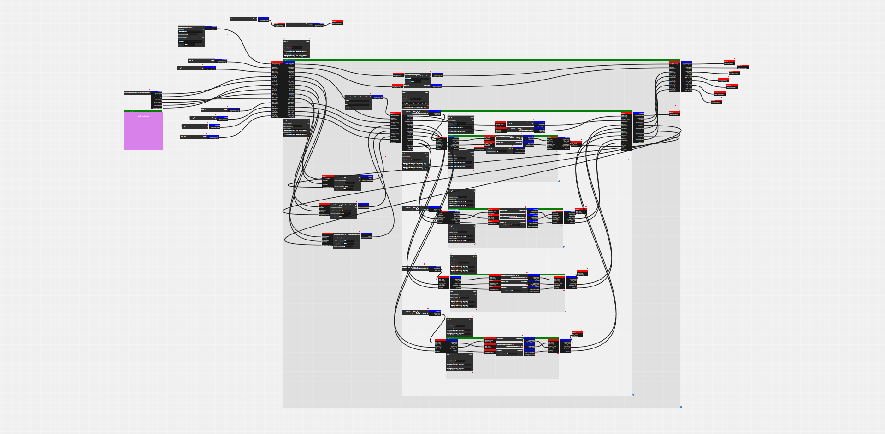

# Cuttlefish

Cuttlefish is a modular browser computing system and a member of [the squidworks project](https://gitlab.cba.mit.edu/squidworks/squidworks), an effort to develop a distributed dataflow computing protocol.

Here, modular code is wrapped in dataflow descriptors and handles that allow rapid assembly of computing applications (programs!).

Cuttlefish also serves as the eyes into remote dataflow systems - meaning we can use it as a tool to assemble networks of computers to build, use, modify, and discover distributed programs.



# How it Works

### Hunks: Modular Code Blocks

Cuttlefish runs programs that are made of 'hunks' - each hunk is a small block of code. In the browser, these are [ECMAScript Modules](https://developer.mozilla.org/en-US/docs/Web/JavaScript/Reference/Statements/import) that are loaded from the server and dropped into the client at runtime.

### Typed Data Interfaces

Hunks interface with the rest of the world through data ports - inputs and outputs - and their state variables. Each of these interfaces *is typed* - this helps us when we serialize messages (Cuttlefish is made for networks) - and helps everyone understand what hunks are meant to do.

Typing is rendered in `/typeset.js` - we can only connect outputs to inputs when a function exists here to copy (and convert) data from the output-type to the input-type. These functions are directional!

### Flowcontrolled Runtime

When Cuttlefish is running, it ferries data between hunk outputs to inputs, and gives each hunk some time to operate on those inputs, producing new outputs. By connecting different hunks in graphs, we can develop programs.

Data ferrying takes place according to a set of flowcontrol rules: data must be explicitly taken off of an input port before an output can push more data towards it. This means that processes which take time - and messages that have to traverse a network - don't overrun one another. It also means that cuttlefish is *buffer free* - this is a big win for systems where order of execution should be maintained, and where responsiveness is desired.

### Polymorphic Hunks

To handle some complexity - particularly with typing - we can write hunks whose inputs and outputs change based on some of their state variables. For an example of this, see `hunks/flowcontrol/syncpressure.js`.

# Usage

To use Cuttlefish, we can serve it locally [as described here](#running-locally) and load it from the browser. This makes local development easier.

A menu is accessible on right-click. Here, we can add new hunks, and by dragging outputs on to inputs, connect them to build programs. Because outputs and inputs are typed, we can only connect outputs to inputs of a type that we can convert between.


Some hunks have small state variables - like this thresholding value. We can modify these.


Programs can be saved and re-instantiated:


We can extend our programs into other computing domains. Here, I'm adding a serialport link into a circuit board running [ponyo](https://gitlab.cba.mit.edu/squidworks/ponyo).


Now I can reconfigure this remote section of the graph, adding code modules here as well, and connecting them to my modules in the browser:


I can save distributed state locally, and attempt to re-instate it after system resets.


To delete hunks, right click on their title bar. We can also copy hunks, and we can remove connections by right-clicking on them.

# Running Locally

Cuttlefish emerges from a small node.js server, and the best way to develop / use it is still to run a local copy of this on your machine.

First, you should [install node.js](https://nodejs.org), if you're on a Mac / Unix (Raspberry Pi!), I would highly recommend [NVM](https://github.com/nvm-sh/nvm), and windows has [an installer](https://nodejs.org) that works brilliantly.

Then, we need to install a few packages. Clone this repo wherever you'd like in your machine, ``cd`` to that directory, and run:

``npm install express``

If you just want to run the browser tools, you're now done. If you want to use CF to connect to hardware, do:

``npm install ws``

and

``npm install serialport``

You can now run Cuttlefish by doing:

``node cf``

It should then report an IP and port. One is your local address, if the browser you are using is on the same machine as the node process, and the other is the machine's outward facing IP. You should be able to point the browser to one of these IPs, and you're off and cuttling.

# Development

Example hunks are below, commented. **To add a new hunk, simply copy an existing hunk, or the `hunks/template.js` file into a new location and modify it - (hunks are named by their file location)** - cuttlefish will automatically pick it up when you hit 'add a hunk' in the environment.

In the browser, the development tools are a great friend. Uncaught exceptions can shutdown the runtime loop, so keep an eye on the console.

```javascript
/*

hunk template

*/

// these are ES6 modules
import {
  Hunkify,
  Input,
  Output,
  State
} from './hunks.js'

// our function name actually doesn't matter: hunks in js are named by their
// location on disk
export default function Name() {
  // this fn attaches handles to our function-object,
  Hunkify(this)

  // inputs, outputs, and state are objects.
  // they each have a type and a name
  let inA = this.input('string', 'quiet')
  let outB = this.output('string', 'loud')

  // states take another argument: their default startup value
  let stateItem = this.state('string', 'exclaim', '!')

  // State items also have change handlers,
  stateItem.onChange = (value) => {
    // at this point, a request to update this state item to the provided value
    // has been made
    console.log('requests:', value)
    // we can reject that, by doing nothing here, or we can
    stateItem.set(value)
    // or compute on it, set limits, etc
  }

  // hunks can choose to- or not- have init code.
  // at init, the module has been loaded into the JS engine and state variables have been
  // recalled from any program save - so this is a good point
  // to check any of those, and setup accordingly ...
  this.init = () => {
    this.log('hello template world')
  }

  // there are no rules within this closure, local functions, data, etc...
  let internalVariable = 'local globals'
  function internalFunc(str) {
    let caps = str.toUpperCase()
    caps += stateItem.value
    return (caps)
  }

  // to divide time between hunks, each has a loop function
  // this is the hunks' runtime, and is called repeatedly, as the process runs
  // here is where we check inputs, put to outputs, do work, etc
  this.loop = () => {
    // typically we check inputs and outputs first,
    // making sure we are clear to run,
    if (inA.io() && !outB.io()) {
      // an input is occupied, and the exit path is empty
      let output = internalFunc(inA.get())
      // put 'er there
      outB.put(output)
    }
  }
}
```

Hunks with DOM elements (to render custom html into the browser) are a bit more involved, here's a small example:

```javascript
/*

debugger ! log anything !

*/

import { Hunkify, Input, Output, State } from '../hunks.js'

export default function ReferenceLogger() {
  Hunkify(this)

  // hmm...
  let tolog = new Input('reference', 'tolog', this)
  this.inputs.push(tolog)

  let prefix = new State('string', 'prefix', 'LOG:')
  let logToConsole = new State('boolean', 'console', true)
  this.states.push(prefix, logToConsole)

  this.dom = {}

  this.init = () => {
    this.dom = $('<div>').get(0)
  }

  this.onload = () => {
    //error here
    let text = $('<div>').addClass('txt').append('- >').get(0)
    $(this.dom).append(text)
  }

  this.loop = () => {
    // this will be called once every round turn
    // typically we check flow control first
    if (tolog.io()) {
      // an input is occupied, and the exit path is empty
      let raw = tolog.get()
      let stringRep
      if (Array.isArray(raw)) {
        stringRep = raw.join(', ')
      } else if (typeof raw === "boolean") {
        stringRep = raw.toString()
      } else {
        // let js do w/e witchcraft it chooses
        stringRep = raw
      }
      $(this.dom).children('.txt').html(stringRep)
      if (logToConsole.value === true) {
        console.log(this.ind, prefix.value, raw)
      }
    }
  }
}
```

For a more involved example, see [the linechart](hunks/data/linechart.js).
