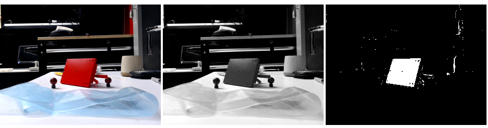
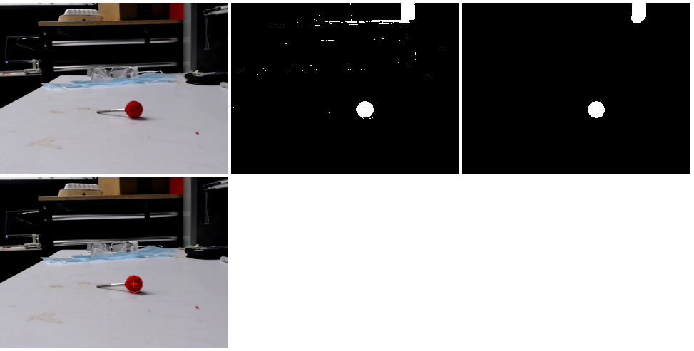
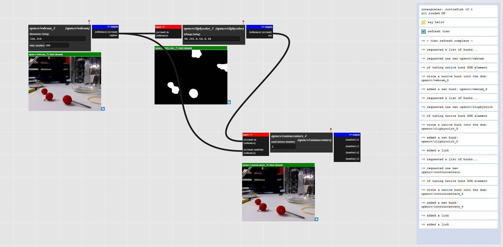
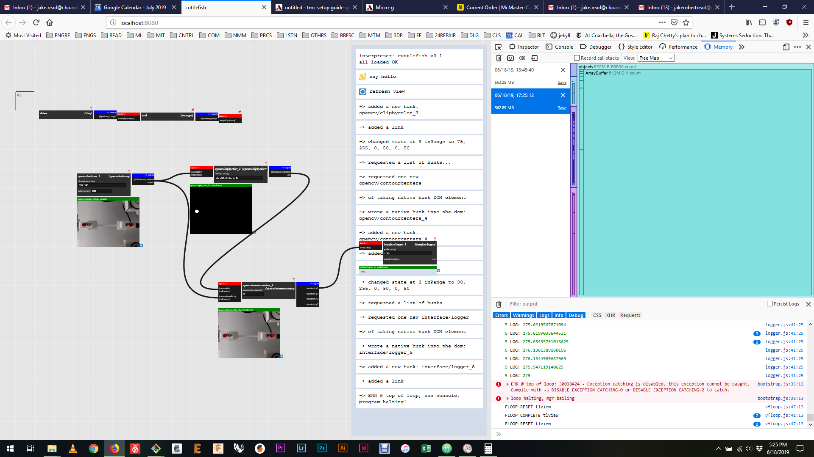

# OpenCV.js for Cuttlefish

Ok, I'm out here to track some markers, and integrate image processing with the cuttlefish runtime. Messy? Probably. Worst case: just do it in the demo, not in cuttlefish. Make machine alive.

here's [the basics of pulling](https://docs.opencv.org/3.4.2/dd/d00/tutorial_js_video_display.html) images from a webcam, nice

here's [a pointer into will's work on the same](https://gitlab.cba.mit.edu/assembledAssemblers/assemblerConsole/blob/master/js/utils.js)

First was getting this up and running. OpenCV.js is a ~10mb js file (!) 'compiled' [using emscripten](https://docs.opencv.org/3.4.6/d4/da1/tutorial_js_setup.html) or can alternately be [downloaded directly](https://docs.opencv.org/3.4.2/opencv.js") (notice easy-to-change version # in url). From my cursory glance, this uses some webasm, so that's pretty cool.

To load, there's a utils.js file that I think openocv wrote (?) that will also uses. This helps do 'other stuff' like load webcams, etc. First and foremost, it loads the hefty openocv into the browser all async-like. I re-wrote this as a promise,

```javascript
let loadOpenCv = () => {
  return new Promise((resolve, reject) => {
    let script = document.createElement('script')
    script.setAttribute('async', '')
    script.setAttribute('type', 'text/javascript')
    script.addEventListener('load', () => {
      resolve()
    })
    script.addEventListener('error', (err) => {
      console.error('failed to load script', err)
      reject(err)
    })
    script.src = OPENCV_URL
    let node = document.getElementsByTagName('script')[0]
    node.parentNode.insertBefore(script, node)
  })
}
```

Apres la, I chain on a camera source...

```javascript
let startCamera = () => {
  return new Promise((resolve, reject) => {
    let video = document.getElementById('videoInput')
    navigator.mediaDevices.getUserMedia({
      video: true,
      audio: false
    }).then((stream) => {
      video.srcObject = stream
      video.play()
      resolve()
    }).catch((err) => {
      console.error('camera error', err)
      reject(err)
    })
  })
}
```

OK, loaded, should do some stuff then. Will recommends outlining and finding centroids as a quick route to success. I got some big red balls, and I'll try that. Typically we just threshold a gray image, but this time I'll pull out just the red channel...

This looks like it works pretty well. Bless the lords of extremely-bright filaments, here's a really simple 'inrange' thresholding over red to pick this part out:



I was trying to hit those other markers (circles) but they are bit too brown. That red filament really kicks. Ok. Now the contour...

Here's [basic matrix ops on these things](https://docs.opencv.org/3.4/de/d06/tutorial_js_basic_ops.html).

Great, I've gotten this up to finding the center point of a red thing. Here's my output:



## CF meets CV



This is OK. It slows the CF dom down some - pans and zooms have a noticable 'tick' on frames, so, the only way to learn how to make performance computing is to actually try to do difficult things.

I'm up to where I was at with the demo, now in cf. Next is outputting some values.

A final roll would see well-configurable statemachines for those hunks: i.e. variable #s of outputs, variable frame sizes. Lots to handle: easier is to just take simple cases on first...

Might try to roll in some charts as well, I figure. Maybe: take the difference of two variables, scale to some #, plot that.

There's a small hardware trick to pull also... and I'd like to sleep tonight, so...

## Memory

Obviously, I should be sensitive with this. My suspicion is that the video element is somehow playing into a lost frame or ... but I have no idea. Here's one 512mb ArrayBuffer ... my guess is that's an opencv object.


